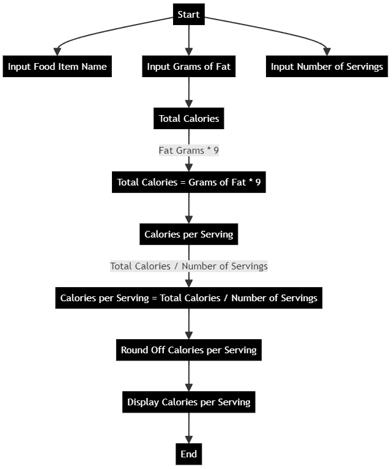
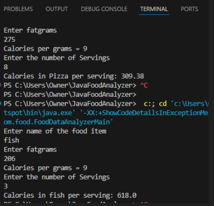

# Food Data Analyzer

# lab 2
Food Data Analyzer is a Java application designed to process and analyze food data, specifically calculating calories per serving based on fat grams, total calories, and servings.

## Project Structure
          analyzerfood/
        README.md
        pom.xml
        src/
            main/
                java/
                    com/
                        food/
                            FoodDataAnalyzerMain.java
                            FoodDataProcessor.java
                            
                resources/
                    images/
                        flowchartfood.png
            test/
                java/
        target/
            classes/
                com/
                    food/
                        FoodDataAnalyzerMain.class
                        FoodDataProcessor.class
                        
            test-classes/

## Flowchart

 ## Display Result
 

## Usage

The program accepts user input for the name of the food item, fat grams, total calories, and servings, and calculates the calories per serving. The program displays the result in the console.

Dependencies
The program uses the following dependencies:

Java 11
JUnit 5
Maven

## author
Harry Joseph, September 29, 2024